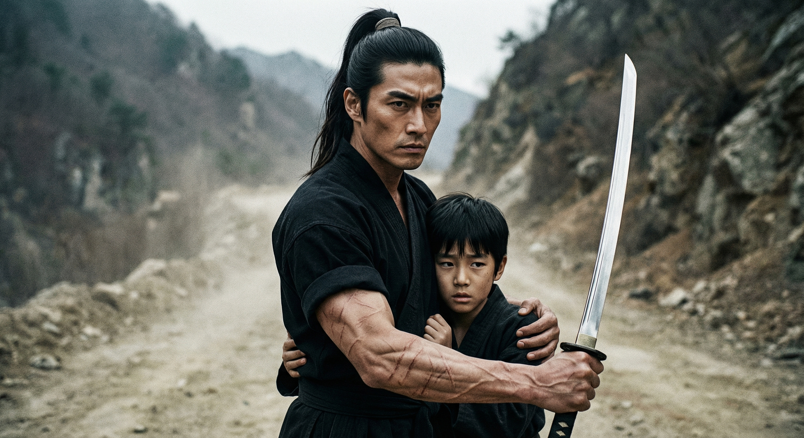
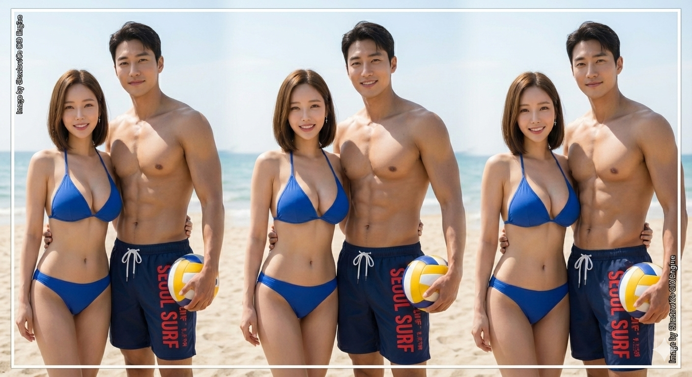

## 🧩 Core Technology & Visualization

### 1. NLCS (Natural Language Constraint System) 아키텍처
**산만한 AI를 통제하는 기술적 원리:** LLM의 환각(Hallucination)을 억제하고, 게임 밸런스의 장기적 일관성을 유지하기 위한 '벡터 중력(Vector Gravity)' 형성 구조도입니다. (Analyzed by NotebookLM)

---

### 2. CID (Character Identity Dynamics) Engine 결과물
**텍스트로 미학을 코딩하다:** 추상적인 '느낌'이 아니라, 골격·비율·연령대·분위기 변수를 텍스트로 정밀 제어하여 생성한 시안(Reference)입니다.

#### 🖌️ 한국형 무협/동양 판타지 캐릭터 (K-Fantasy Style)
> 서구적인 이목구비가 아닌, 한국 웹툰/게임 특유의 '반실사 동양풍' 미학을 정확히 구현합니다.

| 남성 무사 (절제된 카리스마) | 여성 검객 (역동적 포즈) |
| :---: | :---: |
|  |  |

| 서사적 연출 (보호와 결의) | 학자풍 여성 (지적 분위기) |
| :---: | :---: |
|  |  |

#### 📐 페이셜 구조 및 디테일 제어 (Facial Structure Control)
> '부드러운 각이 있는 턱선(Soft-square jawline)', '수평적 눈매' 등 CID 엔진의 해부학적 파라미터 적용 결과입니다.

| 남성 얼굴 디테일 | 여성 45도 측면/정면 구조 |
| :---: | :---: |
|  |  |

#### ⏳ 연령 및 분위기 변수 통제 (Age & Mood Control)
> 동일한 프롬프트 구조에서 '나이(Age)' 변수만 변경했을 때, 피부 톤과 분위기가 어떻게 달라지는지 검증한 결과입니다.

| 20대 커플 (청량함/활기) | 중년 커플 (성숙함/여유) |
| :---: | :---: |
|  |  |

---

### 📂 Repository Structure
본 레포지토리(Whitepapers)는 S-Engine의 설계 사상과 연구 기록을 담고 있습니다.

# whitepapers
ShadowK's foundational whitepapers.

Conceptual frameworks only.

Open for public use and research under MIT License.
